# 🍿 PopcornIQ


A modern Movie Tracker web application built with **React** and powered by the **TMDB (The Movie Database) API**. Browse trending movies, search for your favourites, view detailed information, and maintain your personal Watchlist and Watched collections.

---

## 🚀 Live Demo

🔗 **Live Website:https://popcorn-iq-tmdb.vercel.app/**

---

## 📸 Screenshots

### 🏠 Home Page

Browse popular movies on the home page with a clean and responsive interface.

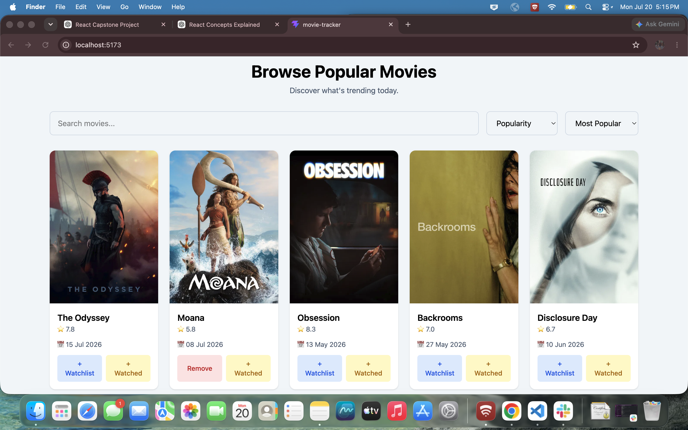

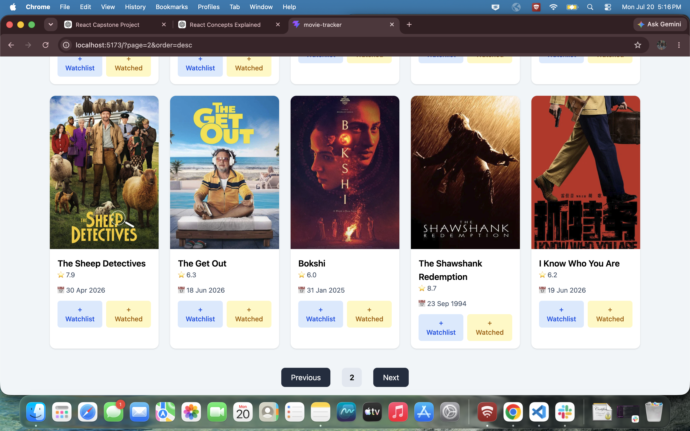

---

### 🔍 Search Results

Search for movies by title with debounced search functionality.


---

### ↕️ Sorting Movies

Sort movies using different criteria and order.

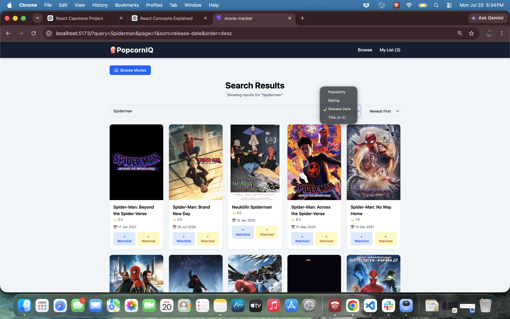
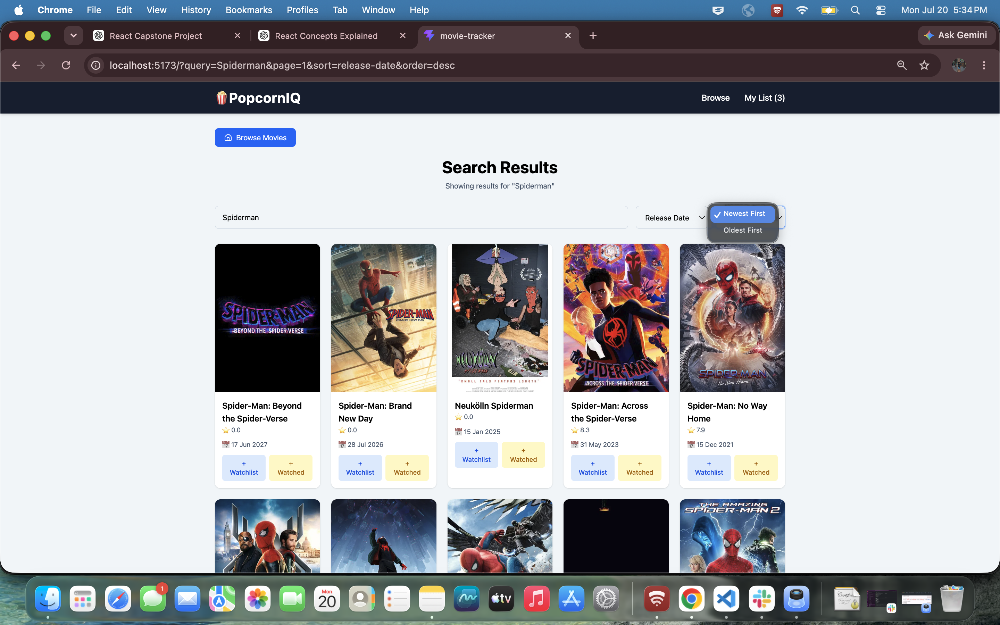

---

### 📄 Movie Details

View complete movie information including overview, genres, runtime, release date and ratings.

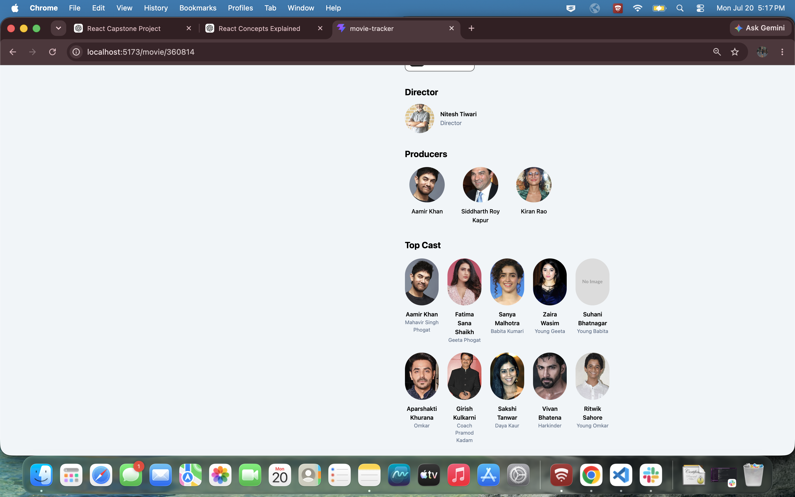

---

### 🎭 Cast & OTT Providers

See cast members with profile images along with available streaming providers.

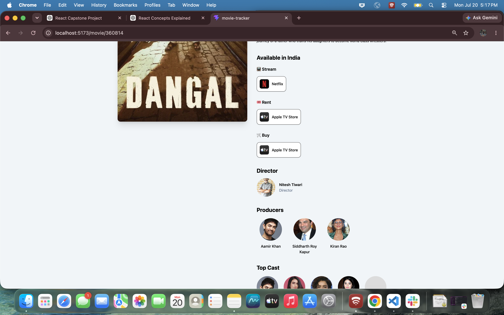

---

### ⭐ User Rating

Rate movies after adding them to your watched list.

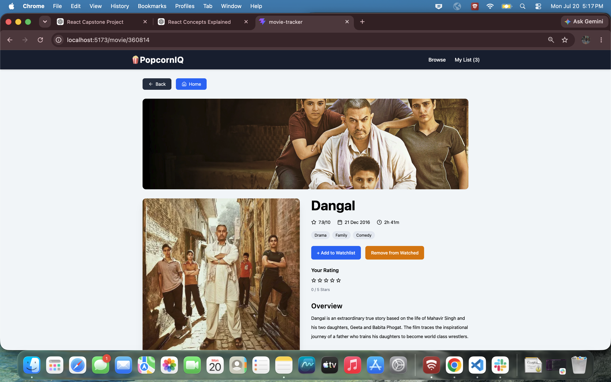

---

### 🎬 Movie Card Quick Actions

Add or remove movies directly from the movie cards without opening the details page.

**Default State**

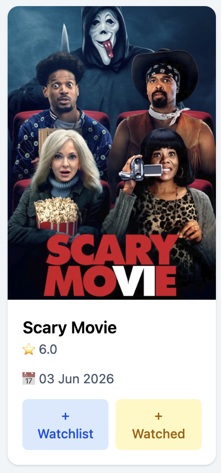

**Added to Watchlist**

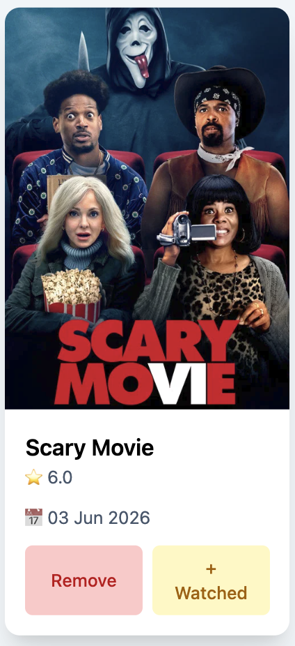

**Added to Watched**

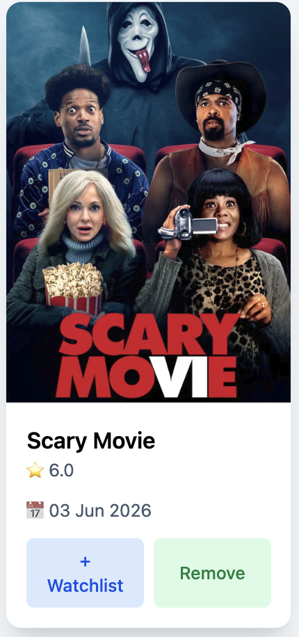

**Added to Both Lists**

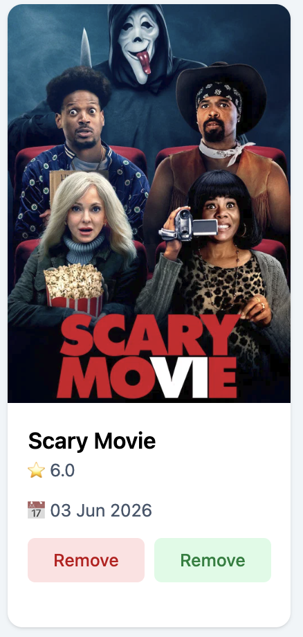

---

### 📚 My Library

Maintain your personal movie library with separate Watchlist and Watched collections.

**Watchlist**

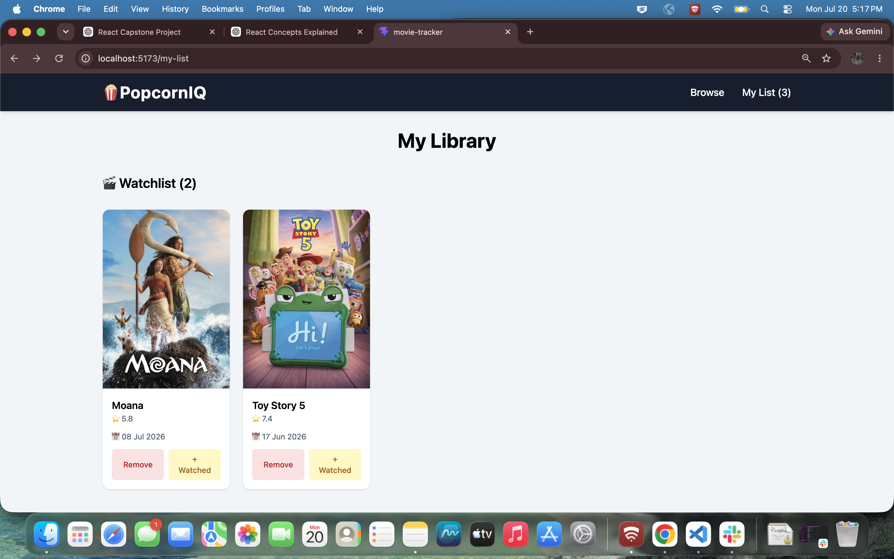

**Watched**

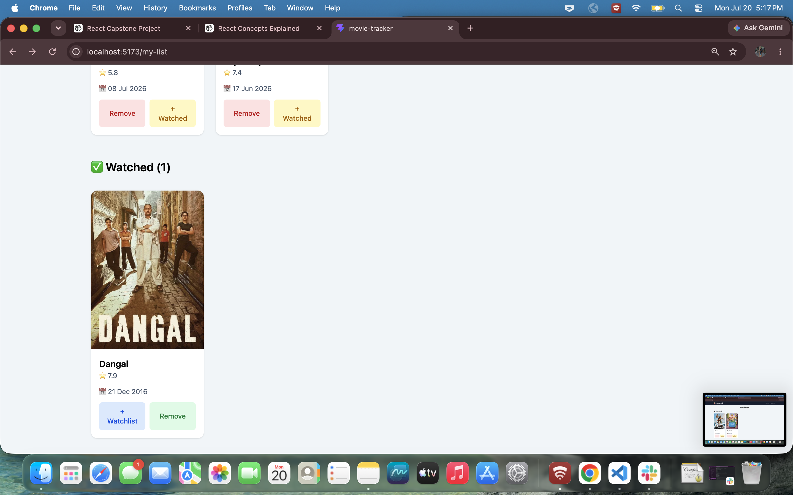

---

## ✨ Features

### 🔍 Browse & Search

- Browse popular movies
- Search movies by title
- Debounced search
- URL-based search state
- Pagination support
- Sorting options

### 🎞 Movie Details

- Movie overview
- Poster & backdrop
- Genres
- Runtime
- Release date
- Director
- Producers
- Cast with profile images
- OTT streaming providers

### 📚 Personal Library

- Add movies to Watchlist
- Remove movies from Watchlist
- Add movies to Watched
- Remove movies from Watched
- Rate watched movies
- Ratings stored locally
- Library persists using Local Storage

### ⚡ User Experience

- Loading indicators
- Error handling with retry option
- Responsive UI
- Clean card-based layout
- Quick add/remove actions directly from Movie Cards

---

## 🛠 Tech Stack

### Frontend

- React
- Vite
- React Router DOM
- Tailwind CSS

### State Management

- Context API
- useReducer

### Hooks

- useState
- useEffect
- useMemo
- useCallback
- Custom Hooks

### API

- TMDB API

### Storage

- Local Storage

---

## 📂 Project Structure

```text
src
├── api
├── components
├── constants
├── context
├── hooks
├── pages
├── utils
├── App.jsx
└── main.jsx
```

---

## 🧠 React Concepts Used

- Components
- Props
- State Management
- Context API
- useReducer
- Custom Hooks
- React Router
- Conditional Rendering
- Lists & Keys
- Event Handling
- Memoization
- URL Search Parameters
- Local Storage
- Reusable Components

---

## ⚙️ Installation

Clone the repository

```bash
git clone <repository-url>
```

Navigate into the project

```bash
cd movie-tracker
```

Install dependencies

```bash
npm install
```

Create an environment file

```text
.env
```

Add your TMDB Access Token

```env
VITE_TMDB_ACCESS_TOKEN=YOUR_ACCESS_TOKEN
```

Run the development server

```bash
npm run dev
```

---

## 🌐 API Used

This application uses the **TMDB (The Movie Database) API** to fetch:

- Popular Movies
- Search Results
- Movie Details
- Cast & Crew Information
- Streaming Providers

---

## 📈 Future Improvements

- Infinite scrolling
- Genre filtering
- Trailer support
- Dark mode
- User authentication
- Cloud sync
- Recommendations

---

## 👨‍💻 Author

**Arya Jain**

Software Engineer | React Developer

GitHub: https://github.com/Aryayayayaa
