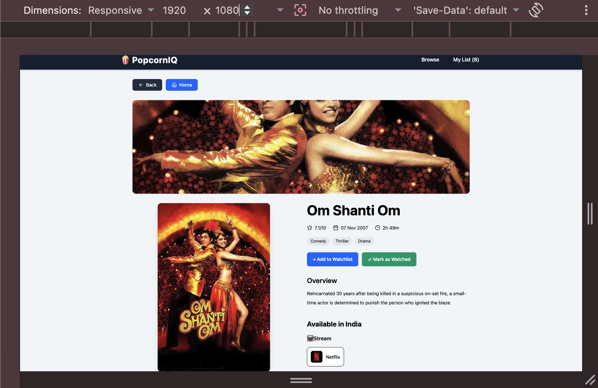
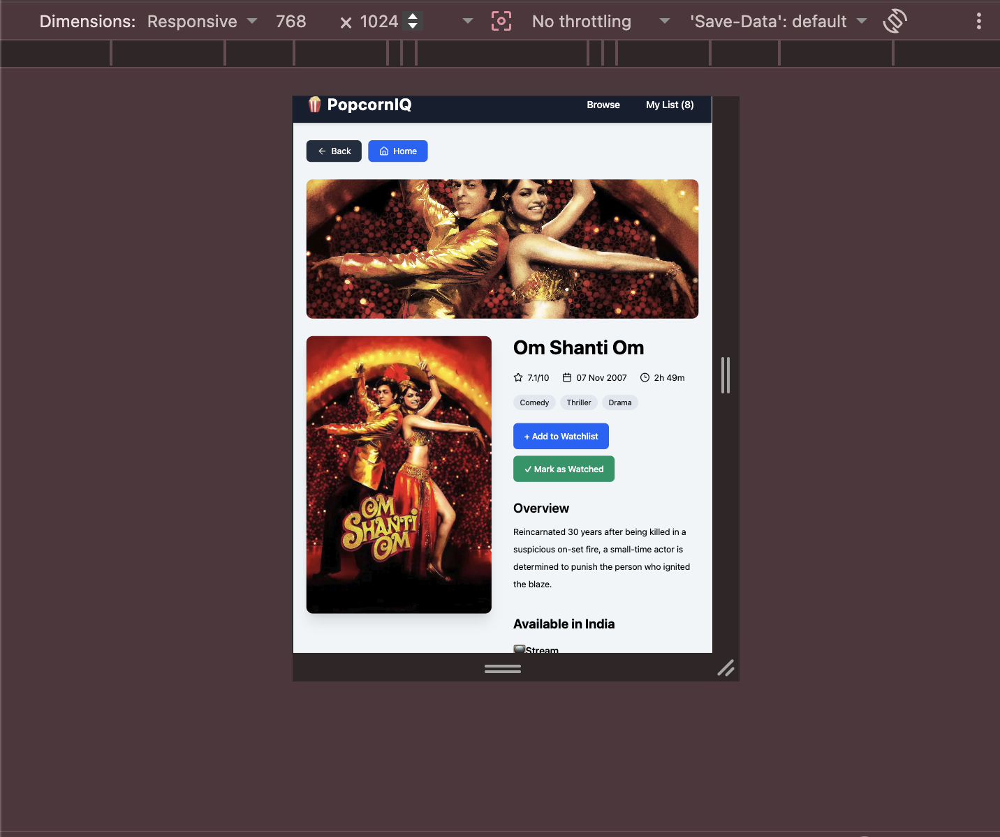
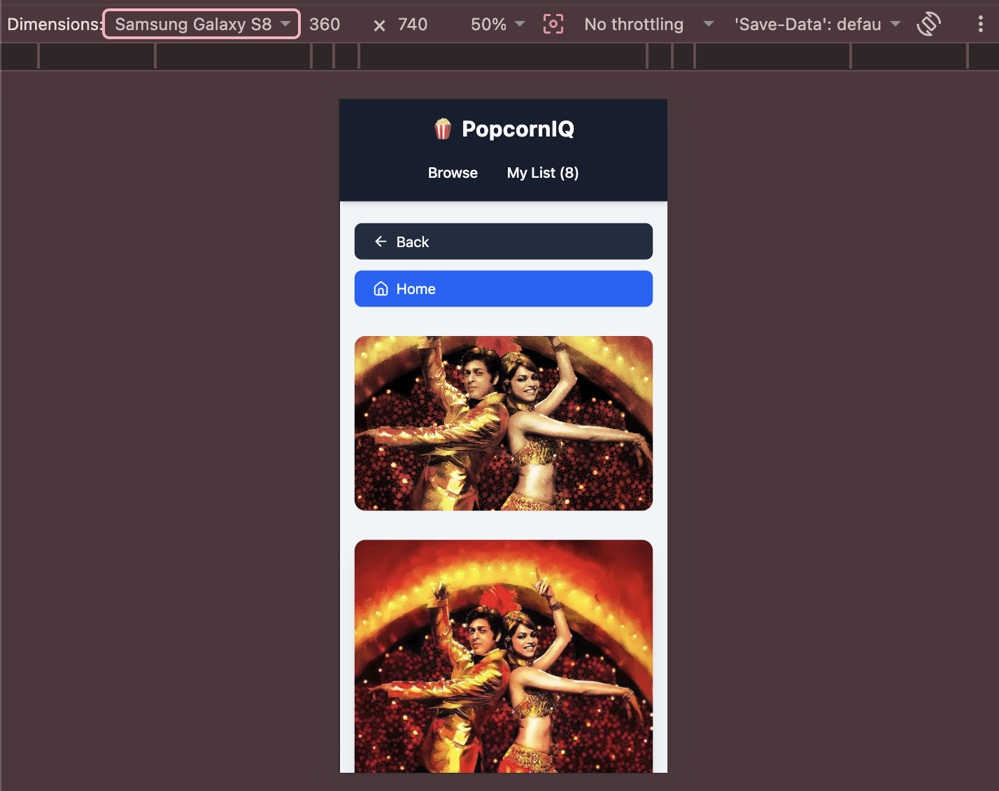
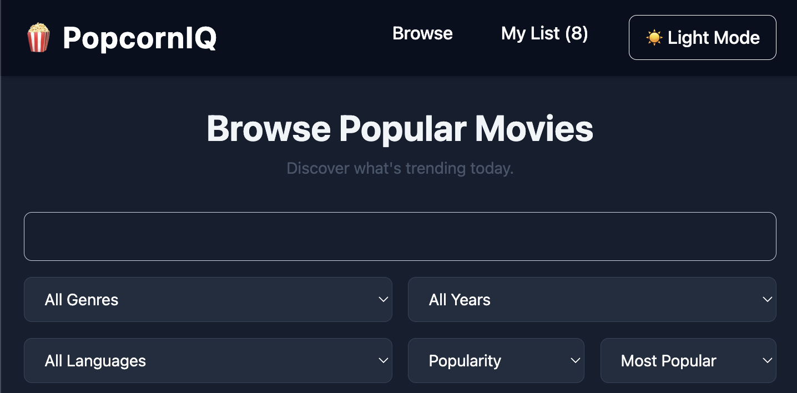

# 🍿 PopcornIQ


A modern movie discovery and tracking web application built with **React** and powered by the **TMDB (The Movie Database) API**. Browse popular movies, search for your favourites, filter and sort results, explore detailed movie information, discover OTT availability in India, and maintain your personal Watchlist and Watched collections.

---

## 🚀 Live Demo

🌐 Live Website: https://popcorn-iq-tmdb.vercel.app/

📂 Source Code: https://github.com/Aryayayayaa/popcorniq

---

## 📸 Screenshots

### 🏠 Home Page

Browse popular movies on the home page with a clean and responsive interface.


---

### 🔍 Search Results

Search for movies by title with debounced search functionality.


---

### ↕️ Sorting Movies

Sort movies using different criteria and order.


---

### 📄 Movie Details

View complete movie information including overview, genres, runtime, release date, cast, crew, ratings, and OTT availability in India.
Rate movies after adding them to your watched list.


---

### 🎭 Cast & OTT Providers

See cast members with profile images along with OTT availability in India. Click supported providers to open their official streaming platforms in a new tab.


---

### 🎬 Movie Card Quick Actions

Add or remove movies directly from the movie cards without opening the details page.

**Default State**


**Added to Watchlist**


**Added to Watched**


**Added to Both Lists**


---

### 📱 Responsive Design

Optimized for desktop, tablet, and mobile devices.

**Desktop View:**


**Tablet View:**


**Mobile View**


---

### 📚 My Library

Maintain your personal movie library with separate Watchlist and Watched collections.

**Watchlist**


**Watched**


---

### New Features Added:

New Features added later which include:

- Theme Mode
- Filtering based on Genre, Release Year and Language



---

## ✨ Features

### 🔍 Browse & Search

- Browse popular movies
- Search movies by title
- Debounced search
- Pagination
- URL-based search state
- Genre filtering
- Release year filtering
- Original language filtering
- Multiple filter combinations
- Advanced sorting

### 🎞 Movie Details

- Movie overview
- Poster & backdrop
- Genres
- Runtime
- Release date
- Director
- Producers
- Cast with profile images
- OTT availability in India
- Stream, Rent, Buy and Watch with Ads categories
- Direct links to supported OTT platforms
- User ratings

### 📚 Personal Library

- Add movies to Watchlist
- Remove movies from Watchlist
- Add movies to Watched
- Remove movies from Watched
- Rate watched movies
- Ratings stored locally
- Library persists using Local Storage

### 📱 Responsive Design

- Optimized for desktop, tablet, and mobile devices
- Responsive movie grid layout
- Adaptive navigation and spacing
- Flexible movie details page
- Touch-friendly buttons and interactive elements

### ⚡ User Experience

- Loading indicators
- Error handling with retry option
- Responsive UI
- Clean card-based layout
- Quick add/remove actions directly from Movie Cards
- Dark mode
- Theme persistence
- Loading indicators
- Error handling
- Retry support
- Quick Watchlist actions
- Quick Watched actions

---

### Frontend

- React 19
- Vite
- React Router DOM
- Tailwind CSS v4

### State Management

- Context API
- useReducer

### Data Fetching

- Fetch API
- Custom Hooks

### Styling

- Tailwind CSS
- Responsive Design

### Storage

- Local Storage

### API

- TMDB API

---

## 📂 Project Structure

```text
src
├── api
├── components
│   ├── filters
│   ├── movie
│   └── ...
├── constants
├── context
├── hooks
├── pages
├── utils
├── App.jsx
└── main.jsx
```

---

## 🧠 React Concepts Used

- Components
- Props
- State Management
- Context API
- useReducer
- Custom Hooks
- React Router
- Conditional Rendering
- Lists & Keys
- Event Handling
- Memoization
- URL Search Parameters
- Local Storage
- Reusable Components
- useCallback
- URL Search Params
- Custom Reducers
- Component Composition

---

## ⚙️ Installation

Clone the repository

```bash
git clone https://github.com/Aryayayayaa/popcorniq.git
```

Navigate into the project

```bash
cd movie-tracker
```

Install dependencies

```bash
npm install
```

Create an environment file

```text
.env
```

Add your TMDB Access Token

```env
VITE_TMDB_ACCESS_TOKEN=YOUR_ACCESS_TOKEN
```

Run the development server

```bash
npm run dev
```

---

## 🌐 API Used

This project uses the TMDB API to fetch:

- Popular Movies
- Search Results
- Movie Details
- Cast & Crew
- Watch Providers
- Genres
- Discover Movies

---

## 📈 Future Improvements

- Infinite scrolling
- Trailer support
- User authentication
- Cloud sync
- Recommendations
- Support multiple countries for OTT availability

---

## ⭐ Key Highlights

- Built with React 19 and Vite
- Uses TMDB REST API
- Global state managed with Context API + useReducer
- Reusable custom hooks for API communication
- Responsive design for desktop, tablet and mobile
- Local Storage persistence
- Dynamic routing with React Router
- URL-based filtering and search

---

## 📚 What I Learned

While building PopcornIQ, I gained practical experience with:

- Designing reusable React components
- Creating custom hooks for API integration
- Managing global state using Context API and useReducer
- Persisting application state with Local Storage
- Building responsive layouts using Tailwind CSS
- Working with REST APIs and asynchronous data fetching
- Organizing a scalable React project structure

---

## 👨‍💻 Author

**Arya Jain**

Software Engineer | React Developer

GitHub: https://github.com/Aryayayayaa
